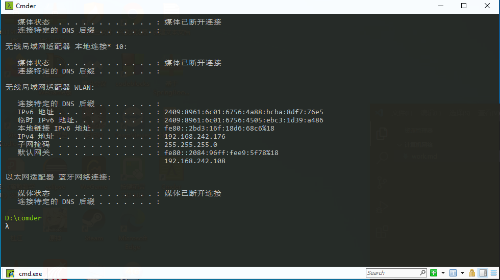
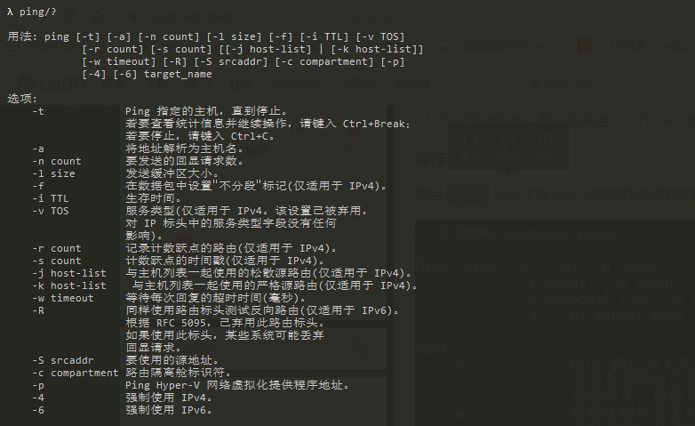
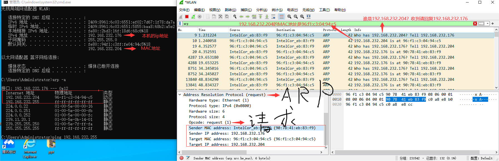
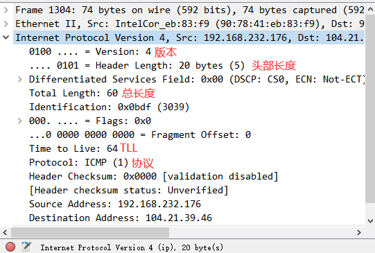
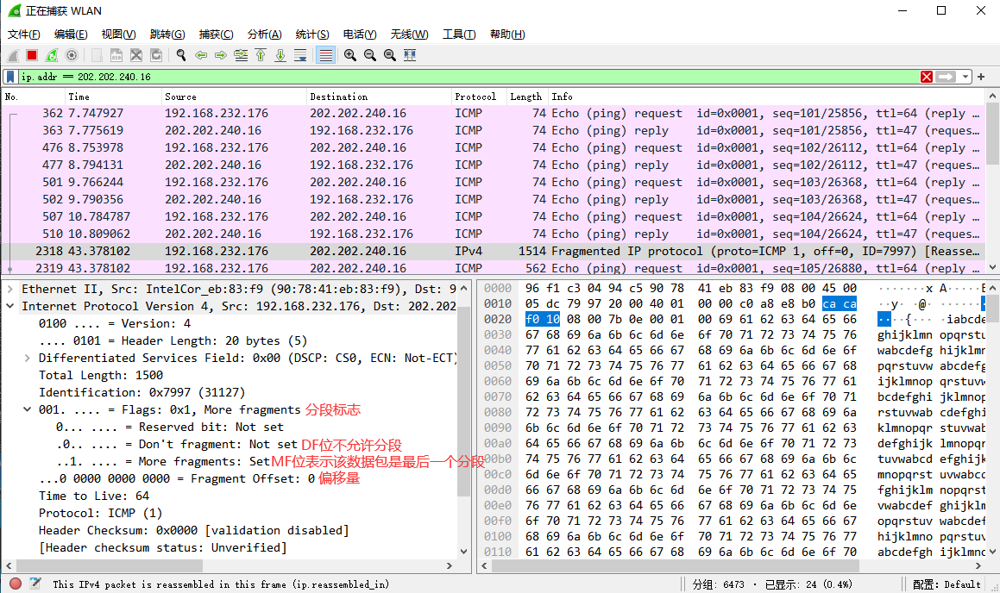
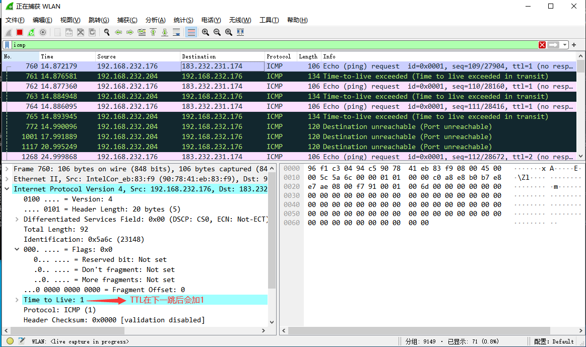
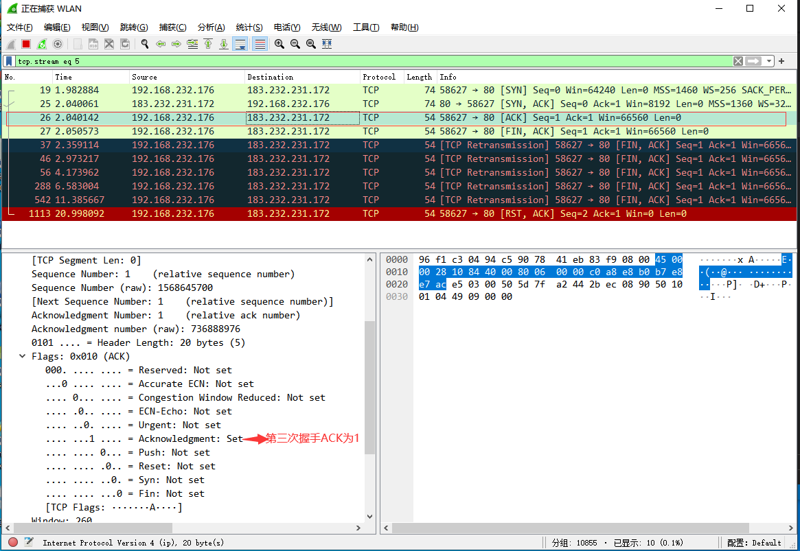

# 验证性实验

## ipconfig
## 实作一 
使用 ipconfig/all 查看自己计算机的网络配置，尽可能明白每行的意思，特别注意 IP 地址、子网掩码 Subnet Mask、网关 Gateway。

## 实作二
使用 ipconfig/all 查看旁边计算机的网络配置，看看有什么异同。

问题：
你的计算机和旁边的计算机是否处于同一子网，为什么？ 
答：主机号不同，ipv4网络号不相同。子网掩码不相同。网关不相同。 IP地址和子网掩码相与得到了不一样的网络地址，因此与相邻计算机不处于同一子网。

## ping
## 实作一
要测试到某计算机如 重庆交通大学 Web 服务器的连通性，可以使用 ping www.cqjtu.edu.cn 命令，也可直接使用 IP 地址。

## 实作二
使用 ping/? 命令了解该命令的各种选项并实际使用。

问题：
假设你不能 ping 通某计算机或 IP，但你确定该计算机和你之间的网络是连通的，那么可能的原因是什么？该如何处理能保证 ping 通？ 
 答： 网络是连通的，但是不能ping通，可能原因是：首先，有可能输入的ip地址输入错误了，不能找到；其次，可能两者不属于同一个子网；还有可能由于对方设立了防火墙，防火墙阻止了ping连接。

答：如何保证ping连通？首先，ping 127.0.0.1 ，测试自己计算机的状态，如果 OK，那么说明本机网络软件硬件工作正常，否则，问题在本机，检查本机 TCP/IP 配置即网卡状态等；其次，ping旁边的计算机，测试到旁边计算机的连通性，如果OK，那么说明本子网内部工作正常，否则，问题在本机网络出口到交换机之间，检查本机网卡到交换机的连线等；如果还是不行，南无就ping网关地址，测试到网关的连通性，如果 OK，那么说明本子网出口工作正常，否则，问题在网关，这是你无能为力的事情，报告给网管。

问题：
假设在秘籍中进行的网络排查中，ping 百度的 IP 即 ping 14.215.177.39 没问题，但 ping 百度的域名即 ping www.baidu.com 不行，那么可能的原因是什么？如何进行验证和解决？ 
答：可以ping通ip但是域名ping不通说明域名解析不出来。负责解析域名的，是DNS（域名解析协议），所以，我们首先先清空一下DNS缓存，然后设置电脑的DNS，然后再ping， 如果还是ping不通 则可联系给域名服务的服务商。 因为QQ是不需要DNS解析域名的，DNS再怎么出问题也不会影响QQ登录。

另外，经常有同学问到的："能上 QQ，但不能上网" 跟这个问题的原因是相似的。

## tracert
## 实作一
要了解到某计算机如 www.baidu.com 中间经过了哪些节点（路由器）及其它状态，可使用 tracert www.baidu.com 命令，查看反馈的信息，了解节点的个数。

## 实作二
ping.pe 这个网站可以探测从全球主要的 ISP 到某站点如 https://qige.io 的线路状态，当然也包括各线路到该主机的路由情况。请使用浏览器访问 http://ping.pe/qige.io 进行了解。

问题：
tracert 能告诉我们路径上的节点以及大致的延迟等信息，那么它背后的原理是什么？本问题可结合第二部分的 Wireshark 实验进行验证。 
答：Tracert是Windows路由跟踪程序，在cmd中使用，用于确定 IP数据包访问目标所采取的路径。Tracert 命令使用 IP 生存时间 (TTL) 字段和 ICMP 错误消息来确定从一个主机到网络上其他主机的路由。首先，tracert发出一个生存时间 (TTL) 字段为1的IP 数据包到目的地，当路径上的第一个路由器收到这个数据包时，它将TTL减1。此时，TTL变为0，所以该路由器会将此数据包丢掉，并送回一个ICMP消息，tracert 收到这个消息后，计算以下从发出这个ICMP消息到收到反馈之间花费了多长时间，计算出来。

问题：
在以上两个实作中，如果你留意路径中的节点，你会发现无论是访问百度还是棋歌教学网，路径中的第一跳都是相同的，甚至你应该发现似乎前几个节点都是相同的，你的解释是什么？ 

答：本机不管要访问什么网站，首先都要到达自己局域网的网关，再通过通信子网到达其他服务器。

问题:
在追踪过程中，你可能会看到路径中某些节点显示为 * 号，这是发生了什么？ 
答：没有得到响应。

## ARP
## 实作一
运行 arp -a 命令查看当前的 arp 缓存， 请留意缓存了些什么。

然后 ping 一下你旁边的计算机 IP（注意，需保证该计算机的 IP 没有出现在 arp 缓存中，或者使用 arp -d * 先删除全部缓存），再次查看缓存，你会发现一些改变，请作出解释。

## 实作二
请使用 arp /? 命令了解该命令的各种选项。

## 实作三
一般而言，arp 缓存里常常会有网关的缓存，并且是动态类型的。

假设当前网关的 IP 地址是 192.168.0.1，MAC 地址是 5c-d9-98-f1-89-64，请使用 arp -s 192.168.0.1 5c-d9-98-f1-89-64 命令设置其为静态类型的。

问题：
你可能会在实作三的操作中得到 "ARP 项添加失败: 请求的操作需要提升" 这样的信息，表示命令没能执行成功，你该如何解决？ 
答：首先，需要以管理员的身份进行操作，进入windows\system32文件夹找到cmd.exe，右键“以管理员身份运行”。先运行：netsh i i showin 找到正在使用的网卡号，找到WLAN，然后运行：netsh -c i i add neighbors WLAN 【IP地址】【物理地址】
输入 arp -a查看。

问题：
在实作三中，为何缓存中常常有网关的信息？ 
答：缓存中会保存网关的信息，方便下次访问。

我们将网关或其它计算机的 arp 信息设置为静态有什么优缺点？ 
答：优点：将arp信息设置为静态，便于管理。以固定的IP地址或IP地址分组，避免每一次进行上网时都需要繁琐的步骤。 
 缺点：这样的设置又有可能造成IP地址的泄露，被盗用的几率大大提高，造成网络难以正常运行等情况。
## DHCP
## 实作一
一般地，我们自动获取的网络配置信息包括：IP 地址、子网掩码、网关 IP 以及 DNS 服务器 IP 等。使用 ipconfig/release 命令释放自动获取的网络配置，并用 ipconfig/renew 命令重新获取，了解 DHCP 工作过程和原理。

问题：
如果你没能成功的释放，请思考有哪些可能的原因并着手进行解决？ 
答：没有开启DHCP客户端服务  
解决方法：
在 “ 运行 ” 中输入 “ sc config DHCP start= AUTO ” 并且再次重启
问题：
在Windows系统下，如果由于某种原因计算机不能获取 DHCP 服务器的配置数据，那么Windows将会根据某种算法自动配置为 169.254.x.x 这样的 IP 地址。显然，这样的 IP 以及相关的配置信息是不能让我们真正接入 Internet 的，为什么？既然不能接入 Internet，那么Winodws系统采用这样的方案有什么意义？ 
答：为了防止主机脱网。保证获取不到IP地址的计算机之间能够通信。

## netstat
## 实作一
Windows 系统将一些常用的端口与服务记录在 C:\WINDOWS\system32\drivers\etc\services 文件中，请查看该文件了解常用的端口号分配。

## 实作二
使用 netstat -an 命令，查看计算机当前的网络连接状况。更多的 netstat 命令选项，可参考上面链接 4 和 5 。

## DNS
## 实作一
Windows 系统将一些固定的/静态的 DNS 信息记录在 C:\WINDOWS\system32\drivers\etc\hosts 文件中，如我们常用的 localhost 就对应 127.0.0.1 。请查看该文件看看有什么记录在该文件中。

## 实作二
解析过的 DNS 记录将会被缓存，以利于加快解析速度。请使用 ipconfig /displaydns 命令查看。我们也可以使用 ipconfig /flushdns 命令来清除所有的 DNS 缓存。

## 实作三
使用 nslookup qige.io 命令，将使用默认的 DNS 服务器查询该域名。当然你也可以指定使用 CloudFlare（1.1.1.1）或 Google（8.8.8.8） 的全球 DNS 服务器来解析，如：nslookup qige.io 8.8.8.8，当然，由于你懂的原因，这不一定会得到正确的答案。

问题：
上面秘籍中我们提到了使用插件或自己修改 hosts 文件来屏蔽广告，思考一下这种方式为何能过滤广告？如果某些广告拦截失效，那么是什么原因？你应该怎样进行分析从而能够成功屏蔽它？ 
答：hosts文件通过屏蔽广告地址来屏蔽广告页面的弹出，其被用来将指定网址映射到指定ip地址，优先级比DNS高。在解析域名的时候，系统会在检查DNS之前检查hosts文件，如果有就不用请求DNS去解析这个网址了。

## cache
## 实作一
打开 Chrome 或 Firefox 浏览器，访问 https://qige.io ，接下来敲 F12 键 或 Ctrl + Shift + I 组合键打开开发者工具，选择 Network 面板后刷新页面，你会在开发者工具底部看到加载该页面花费的时间。请进一步查看哪些文件被 cache了，哪些没有。

## 实作二
接下来仍在 Network 面板，选择 Disable cache 选项框，表明当前不使用 cache，页面数据全部来自于 Internet，刷新页面，再次在开发者工具底部查看加载该页面花费的时间。你可比对与有 cache 时的加载速度差异。

# Wireshark 实验

## 一.数据链路层

## 实作一 ： 熟悉 Ethernet 帧结构

使用 Wireshark 任意进行抓包，熟悉 Ethernet 帧的结构，如：目的 MAC、源 MAC、类型、字段等。

问题 : 
你会发现 Wireshark 展现给我们的帧中没有校验字段，请了解一下原因。

答：Wireshark 在抓包前，物理层网卡已经进行过校验，当我们使用Wireshark进行抓包，抓到的为校验后的包，看到的帧中是没有校验字段。

## 实作二 ： 了解子网内/外通信时的 MAC 地址

 1.ping 你旁边的计算机（同一子网），同时用 Wireshark 抓这些包（可使用 icmp 关键字进行过滤以利于分析），记录一下发出帧的目的 MAC 地址以及返回帧的源 MAC 地址是多少？这个 MAC 地址是谁的？
 答：是旁边计算机的mac地址

 2.然后 ping qige.io （或者本子网外的主机都可以），同时用 Wireshark 抓这些包（可 icmp 过滤），记录一下发出帧的目的 MAC 地址以及返回帧的源 MAC 地址是多少？这个 MAC 地址是谁的？

 答：发出帧的目的mac和返回帧的源mac都是网关的mac地址

 3.再次 ping www.cqjtu.edu.cn （或者本子网外的主机都可以），同时用 Wireshark 抓这些包（可 icmp 过滤），记录一下发出帧的目的 MAC 地址以及返回帧的源 MAC 地址又是多少？这个 MAC 地址又是谁的？
答：都是网关的mac地址，和第二题一样，因为是访问的子网外的地址

问题：

通过以上的实验，你会发现：
访问本子网的计算机时，目的 MAC 就是该主机的
访问非本子网的计算机时，目的 MAC 是网关的
请问原因是什么？

答：因为子网内的计算机是可以通过交换机直接访问的，所以目的MAC可得知就是目的主机的，如果是非本子网的计算机，因为不知道其MAC地址，但访问需要通过网关转发和接收，所以就填网关的MAC地址。

## 实作三 掌握 ARP 解析过程
1.为防止干扰，先使用 arp -d * 命令清空 arp 缓存
2.ping 你旁边的计算机（同一子网），同时用 Wireshark 抓这些包（可 arp 过滤），查看 ARP 请求的格式以及请求的内容，注意观察该请求的目的 MAC 地址是什么。再查看一下该请求的回应，注意观察该回应的源 MAC 和目的 MAC 地址是什么。

3.再次使用 arp -d * 命令清空 arp 缓存
4.然后 ping qige.io （或者本子网外的主机都可以），同时用 Wireshark 抓这些包（可 arp 过滤）。查看这次 ARP 请求的是什么，注意观察该请求是谁在回应。

问题:

通过以上的实验，你应该会发现，

ARP 请求都是使用广播方式发送的
如果访问的是本子网的 IP，那么 ARP 解析将直接得到该 IP 对应的 MAC；如果访问的非本子网的 IP， 那么 ARP 解析将得到网关的 MAC。
请问为什么？
答：如果是访问本子网的ip，可以直接访问，所以ARP解析获取的就是对应ip的MAC，但如果是访问非本子网的ip时是需要经过网关发出去然后通过路由器访问，目标IP收到请求再通过路由器到达网关返回，所以ARP解析获取的就是网关的MAC

# 网络层
## 实作一 熟悉 IP 包结构
使用 Wireshark 任意进行抓包（可用 ip 过滤），熟悉 IP 包的结构，如：版本、头部长度、总长度、TTL、协议类型等字段。

问题:

为提高效率，我们应该让 IP 的头部尽可能的精简。但在如此珍贵的 IP 头部你会发现既有头部长度字段，也有总长度字段。请问为什么？ 
答：因为头部长度是为了让接受方知道报头在哪里结束和读取数据在哪里开始。总长度是为了让接受方的网络层了解传输的数据包含哪些，如果没有这部分，数链层在传输时会对数据长度的填充，对应的网络层不会把填充的部分去掉。

## 实作二 IP 包的分段与重组
根据规定，一个 IP 包最大可以有 64K 字节。但由于 Ethernet 帧的限制，当 IP 包的数据超过 1500 字节时就会被发送方的数据链路层分段，然后在接收方的网络层重组。

缺省的，ping 命令只会向对方发送 32 个字节的数据。我们可以使用 ping 202.202.240.16 -l 2000 命令指定要发送的数据长度。此时使用 Wireshark 抓包（用 ip.addr == 202.202.240.16 进行过滤），了解 IP 包如何进行分段，如：分段标志、偏移量以及每个包的大小等

问题:

分段与重组是一个耗费资源的操作，特别是当分段由传送路径上的节点即路由器来完成的时候，所以 IPv6 已经不允许分段了。那么 IPv6 中，如果路由器遇到了一个大数据包该怎么办？

答：路由器会把该数据包丢掉或者转发到支持该数据包传输的路由上

## 实作三 考察 TTL 事件
在 IP 包头中有一个 TTL 字段用来限定该包可以在 Internet上传输多少跳（hops），一般该值设置为 64、128等。

在验证性实验部分我们使用了 tracert 命令进行路由追踪。其原理是主动设置 IP 包的 TTL 值，从 1 开始逐渐增加，直至到达最终目的主机。

请使用 tracert www.baidu.com 命令进行追踪，此时使用 Wireshark 抓包（用 icmp 过滤），分析每个发送包的 TTL 是如何进行改变的，从而理解路由追踪原理。

问题:
在 IPv4 中，TTL 虽然定义为生命期即 Time To Live，但现实中我们都以跳数/节点数进行设置。如果你收到一个包，其 TTL 的值为 50，那么可以推断这个包从源点到你之间有多少跳？

答：因为设置初始TTL时一般为64或者128，50小于64，说明之前有64-50=14跳

# 传输层
## 实作一 熟悉 TCP 和 UDP 段结构
用 Wireshark 任意抓包（可用 tcp 过滤），熟悉 TCP 段的结构，如：源端口、目的端口、序列号、确认号、各种标志位等字段。
用 Wireshark 任意抓包（可用 udp 过滤），熟悉 UDP 段的结构，如：源端口、目的端口、长度等。

问题:

由上大家可以看到 UDP 的头部比 TCP 简单得多，但两者都有源和目的端口号。请问源和目的端口号用来干什么？

答：端口标识唯一的进程，源端口代表发起通信的进程，目的端口代表接收通信的进程。源端口和目的端口的存在，才可以实现程序之间的通信
## 实作二 分析 TCP 建立和释放连接
打开浏览器访问 qige.io 网站，用 Wireshark 抓包（可用 tcp 过滤后再使用加上 Follow TCP Stream），不要立即停止 Wireshark 捕获，待页面显示完毕后再多等一段时间使得能够捕获释放连接的包。 
第一次握手SYN=1（主机发给服务器）

第二次握手SYN=1 ，ACK=1（服务器发给主机）

第三次握手SYN=0,ACK=1（主机发给服务器）

请在你捕获的包中找到三次握手建立连接的包，并说明为何它们是用于建立连接的，有什么特征。

答：建立 TCP 连接需要通信的双方先完成“三次握手”连接，连接中的一对 Socket 是由互联网地址标志符和端口组成的，窗口大小主要用来做流控制，序列号是用来追踪通信发起方发送的数据包序号，接收方可以通过序列号向发送方确认某个数据包的成功接收，并且前两次握手发的包中SYN=1，只有最后一次握手SYN=0.

请在你捕获的包中找到四次挥手释放连接的包，并说明为何它们是用于释放连接的，有什么特征。

答：
（1）第一次挥手：甲方发送FIN包给乙方表明断开连接，但这只是代表甲方不会再发了，但依然可以接收乙方数据（FIN,ACK=1）
（2）第二次挥手：乙方任然还有数据需要发，则先发ACK包，表明收到甲方发出的FIN包，防止甲方没收到回复而不断发FIN包的情况（ACK=1）
（3）第三次挥手：乙方没有数据需要发，则发FIN包给甲方，表明通信结束，发FIN包后则进入LAST_ACK即超时等待阶段。(FIN,ACK=1)
（4）第四次挥手：甲方收到FIN包后向乙方及时发送ACK包也确认连接中断，这时方才释放连接(ACK=1)

问题一:

去掉 Follow TCP Stream，即不跟踪一个 TCP 流，你可能会看到访问 qige.io 时我们建立的连接有多个。请思考为什么会有多个连接？作用是什么？

答：因为他们之间的连接是短连接，一旦数据发送就会断开，但页面由于缓存所以依然存在，如果需要重新发送数据就需要再次链接。这样连接是为了容纳多个用户同时访问，可以节省访问的通道被长期占用。

问题二:

我们上面提到了释放连接需要四次挥手，有时你可能会抓到只有三次挥手。原因是什么？

答：因为第二次握手和第三次握手合并了，如果对方没有数据发给本端，那么对方也会发FIN给本端，这样ACK和FIN就可能出现在一起导致握手合并了。

# 应用层
应用层的协议非常的多，我们只对 DNS 和 HTTP 进行相关的分析。

## 实作一 了解 DNS 解析
1.先使用 ipconfig /flushdns 命令清除缓存，再使用 nslookup qige.io 命令进行解析，同时用 Wireshark 任意抓包（可用 dns 过滤）。

2.你应该可以看到当前计算机使用 UDP，向默认的 DNS 服务器的 53 号端口发出了查询请求，而 DNS 服务器的 53 号端口返回了结果。

3.可了解一下 DNS 查询和应答的相关字段的含义

问题:

你可能会发现对同一个站点，我们发出的 DNS 解析请求不止一个，思考一下是什么原因？

答：因为这样可以减轻服务器的负载，可能有多个计算机承载着同一服务器，虽然他们ip不同，但却是同一域名，所以访问时可能是不同计算机的ip，并且可以均衡每台计算机的负荷。

## 实作二 了解 HTTP 的请求和应答
1.打开浏览器访问 qige.io 网站，用 Wireshark 抓包（可用http 过滤再加上 Follow TCP Stream），不要立即停止 Wireshark 捕获，待页面显示完毕后再多等一段时间以将释放连接的包捕获。
2.请在你捕获的包中找到 HTTP 请求包，查看请求使用的什么命令，如：GET, POST。并仔细了解请求的头部有哪些字段及其意义。

3.请在你捕获的包中找到 HTTP 应答包，查看应答的代码是什么，如：200, 304, 404 等。并仔细了解应答的头部有哪些字段及其意义。

建议：
HTTP 请求和应答的头部字段值得大家认真的学习，因为基于 Web 的编程中我们将会大量使用。如：将用户认证的令牌信息放到头部，或者把 cookie 放到头部等。

问题:

刷新一次 qige.io 网站的页面同时进行抓包，你会发现不少的 304 代码的应答，这是所请求的对象没有更改的意思，让浏览器使用本地缓存的内容即可。那么服务器为什么会回答 304 应答而不是常见的 200 应答？

答：因为浏览器和服务器可以先进行协商，服务器通知浏览器当前请求资源上一次修改的时间，浏览器第二次发送请求时，本地会先和之前的缓存作比较，如果过期则向服务器发送请求，服务器收到请求后判断资源有无变动，若无则返回304，有则返回新资源和200

# Cisco Packet Tracer 实验
本部分实验共有 15 个，需使用 Cisco Packet Tracer 软件完成。

请大家先了解 VLSM、CIDR、RIP、OSPF、VLAN、STP、NAT 及 DHCP 等概念，以能够进行网络规划和配置。

🌏 参考

CPT 软件使用简介
请使用上面的参考链接 1 ，了解和熟悉 CPT 软件的使用。

直接连接两台 PC 构建 LAN
将两台 PC 直接连接构成一个网络。注意：直接连接需使用交叉线。

进行两台 PC 的基本网络配置，只需要配置 IP 地址即可，然后相互 ping 通即成功。

用交换机构建 LAN
构建如下拓扑结构的局域网：

各PC的基本网络配置如下表：

机器名

IP

子网掩码

PC0

192.168.1.1

255.255.255.0

PC1

192.168.1.2

255.255.255.0

PC2

192.168.2.1

255.255.255.0

PC3

192.168.2.2

255.255.255.0

✎ 问题

PC0 能否 ping 通 PC1、PC2、PC3 ？

答：pc0能ping通pc1 但不能ping通pc2和pc3 因为不在同一子网

PC3 能否 ping 通 PC0、PC1、PC2 ？为什么？

答：pc3能ping通pc2，但不能ping通PC0和PC1

将 4 台 PC 的掩码都改为 255.255.0.0 ，它们相互能 ping 通吗？为什么？

答：相互可以ping通，因为此时四台主机，都处于192.168.0.0这一子网下。

使用二层交换机连接的网络需要配置网关吗？为什么？

答：需要配置网关。二层交换机的网关主要用于远程登录（SSH/telnet）管理，以及发生故障的时候，可以通过SNMP trap消息向网管系统发送报警消息。

✎ 试一试

集线器 Hub 是工作在物理层的多接口设备，它与交换机的区别是什么？请在 CPT 软件中用 Hub 构建网络进行实际验证。

交换机接口地址列表
二层交换机是一种即插即用的多接口设备，它对于收到的帧有 3 种处理方式：广播、转发和丢弃（请弄清楚何时进行何种操作）。那么，要转发成功，则交换机中必须要有接口地址列表即 MAC 表，该表是交换机通过学习自动得到的！

仍然构建上图的拓扑结构，并配置各计算机的 IP 在同一个一个子网，使用工具栏中的放大镜点击某交换机如左边的 Switch3，选择 MAC Table，可以看到最初交换机的 MAC 表是空的，也即它不知道该怎样转发帧（那么它将如何处理？），用 PC0 访问（ping）PC1 后，再查看该交换机的 MAC 表，现在有相应的记录，请思考如何得来。随着网络通信的增加，各交换机都将生成自己完整的 MAC 表，此时交换机的交换速度就是最快的！

📬 秘籍

你还可以使用 CPT 的 Simulation 模式即模拟方式进一步看清楚这个过程！

生成树协议（Spanning Tree Protocol）
交换机在目的地址未知或接收到广播帧时是要进行广播的。如果交换机之间存在回路/环路，那么就会产生广播循环风暴，从而严重影响网络性能。

而交换机中运行的 STP 协议能避免交换机之间发生广播循环风暴。

只使用交换机，构建如下拓扑：

这是初始时的状态。我们可以看到交换机之间有回路，这会造成广播帧循环传送即形成广播风暴，严重影响网络性能。

随后，交换机将自动通过生成树协议（STP）对多余的线路进行自动阻塞（Blocking），以形成一棵以 Switch4 为根（具体哪个是根交换机有相关的策略）的具有唯一路径树即生成树！

经过一段时间，随着 STP 协议成功构建了生成树后，Switch5 的两个接口当前物理上是连接的，但逻辑上是不通的，处于Blocking状态（桔色）如下图所示：

在网络运行期间，假设某个时候 Switch4 与 Switch5 之间的物理连接出现问题（将 Switch4 与 Switch5 的连线剪掉），则该生成树将自动发生变化。Switch5 上方先前 Blocking 的那个接口现在活动了（绿色），但下方那个接口仍处于 Blocking 状态（桔色）。如下图所示：

🗣 注意

交换机的 STP 协议即生成树协议始终自动保证交换机之间不会出现回路，从而形成广播风暴。

📬 秘籍

使用 CPT 的 Simulation 即模拟方式可非常清楚看到这个过程！

路由器配置初步
我们模拟重庆交通大学和重庆大学两个学校的连接，构建如下拓扑：

说明一
交通大学与重庆大学显然是两个不同的子网。在不同子网间通信需通过路由器。

路由器的每个接口下至少是一个子网，图中我们简单的规划了 3 个子网：

左边路由器是交通大学的，其下使用交换机连接交通大学的网络，分配网络号 192.168.1.0/24，该路由器接口也是交通大学网络的网关，分配 IP 为 192.168.1.1

右边路由器是重庆大学的，其下使用交换机连接重庆大学的网络，分配网络号 192.168.3.0/24，该路由器接口也是重庆大学网络的网关，分配 IP 为 192.168.3.1

两个路由器之间使用广域网接口相连，也是一个子网，分配网络号 192.168.2.0/24
说明二
现实中，交通大学和重庆大学的连接是远程的。该连接要么通过路由器的光纤接口，要么通过广域网接口即所谓的 serial 口（如拓扑图所示）进行，一般不会通过双绞线连接（为什么？）。

下面我们以通过路由器的广域网口连接为例来进行相关配置。请注意：我们选用的路由器默认没有广域网模块（名称为 WIC-1T 等），需要关闭路由器后添加，然后再开机启动。

说明三
在模拟的广域网连接中需注意 DCE 和 DTE 端（连线时线路上有提示，带一个时钟标志的是 DCE 端。有关 DCE 和 DTE 的概念请查阅相关资料。），在 DCE 端需配置时钟频率 64000

说明四
路由器有多种命令行配置模式，每种模式对应不同的提示符及相应的权限。

请留意在正确的模式下输入配置相关的命令。

User mode：用户模式
Privileged mode：特权模式
Global configuration mode：全局配置模式
Interface mode：接口配置模式
Subinterface mode：子接口配置模式
说明五
在现实中，对新的路由器，显然不能远程进行配置，我们必须在现场通过笔记本的串口与路由器的 console 接口连接并进行初次的配置（注意设置比特率为9600）后，才能通过网络远程进行配置。这也是上图左上画出笔记本连接的用意。

说明六
在路由器的 CLI 界面中，可看到路由器刚启动成功后，因为无任何配置，将会提示是否进行对话配置（Would you like to enter the initial configuration dialog?），因其步骤繁多，请选择 NO

比如交通大学路由器的初步配置可以如下：

🗣 注意

在我们的实验中可不进行如下的配置，但在现实中为了安全，以下的登录及特权密码等配置是必须的，否则每个人都可操作你的路由器或交换机！

Router>en   // 从普通模式进入特权模式
Router#conf t   // 进入全局配置模式
Router(config)#interface FastEthernet0/0
Router(config-if)#ip address 192.168.1.1 255.255.255.0
Router(config-if)#no shutdown
Router(config-if)#exit
Router(config)#line vty 0 4 //可支持0-4共5个终端同时登录
Router(config-line)#password dswybs // 远程登录密码
Router(config-line)#login
Router(config-line)#exit
Router(config)#enable password dswybs // 特权模式密码
Router(config)#^Z  // 退出
拓扑图中路由器各接口配置数据如下：

接口名

IP

子网掩码

交通大学 Router2 以太网口

192.168.1.1

255.255.255.0

交通大学 Router2 广域网口

192.168.2.1

255.255.255.0

重庆大学 Router3 以太网口

192.168.3.1

255.255.255.0

重庆大学 Router3 广域网口

192.168.2.2

255.255.255.0

拓扑图中各 PC 配置数据如下：

节点名

IP

子网掩码

网关

交通大学 PC0

192.168.1.2

255.255.255.0

192.168.1.1

交通大学 PC1

192.168.1.3

255.255.255.0

192.168.1.1

重庆大学 PC2

192.168.3.2

255.255.255.0

192.168.3.1

重庆大学 PC3

192.168.3.3

255.255.255.0

192.168.3.1

交通大学路由器基本配置如下：
以太网口：

Router>enable   // 从普通模式进入特权模式
Router#configure terminal   // 进入全局配置模式
Router(config)#interface f0/0   // 进入配置以太网口模式
Router(config-if)#ip address 192.168.1.1 255.255.255.0   // 配置该接口的 IP
Router(config-if)#no shutdown   // 激活接口
Router(config-if)#^z   // 直接退到特权模式
Router#
广域网口：

Router>en   // 从普通模式进入特权模式
Router#conf t   // 进入全局配置模式
Router(config)#int s0/0   // 进入配置广域网口模式
Router(config-if)#ip address 192.168.2.1 255.255.255.0   //配置该接口的 IP
Router(config-if)#clock rate 64000    // 其为 DCE 端，配置时钟频率
Router(config-if)#no shutdown   // 激活接口
Router(config-if)#^z   // 直接退到特权模式
Router#
重庆大学路由器基本配置如下：
以太网口：

Router>en   // 从普通模式进入特权模式
Router#conf t   // 进入全局配置模式
Router(config)#int f0/0   // 进入配置以太网口模式
Router(config-if)#ip address 192.168.3.1 255.255.255.0   // 配置该接口的 IP
Router(config-if)#no shutdown   // 激活接口
Router(config-if)#^z   // 直接退到特权模式
Router#
广域网口：

Router>en   // 从普通模式进入特权模式
Router#conf t   // 进入全局配置模式
Router(config)#int s0/0   // 进入配置广域网口模式
Router(config-if)#ip address 192.168.2.2 255.255.255.0   //配置该接口的 IP
Router(config-if)#no shutdown   // 激活接口
Router(config-if)#^z   // 直接退到特权模式
Router#
至此，路由器基本的配置完成。请按照上面 PC 配置表继续配置各个 PC 。

✎ 问题

现在交通大学内的各 PC 及网关相互能 ping 通，重庆大学也类似。但不能从交大的 PC ping 通重大的 PC，反之亦然，也即不能跨子网。为什么？

静态路由
静态路由是非自适应性路由协议，是由网络管理人员手动配置的，不能够根据网络拓扑的变化而改变。 因此，静态路由简单高效，适用于结构非常简单的网络。

在当前这个简单的拓扑结构中我们可以使用静态路由，即直接告诉路由器到某网络该怎么走即可。

在前述路由器基本配置成功的情况下使用以下命令进行静态路由协议的配置：

交通大学路由器静态路由配置：
Router>en   // 从普通模式进入特权模式
Router#conf t   // 进入全局配置模式
Router(config)#ip route 192.168.3.0 255.255.255.0 192.168.2.2   // 告诉交通大学路由器到 192.168.3.0 这个网络的下一跳是 192.168.2.2
Router(config)#exit   //退到特权模式
Router#show ip route    //查看路由表
重庆大学路由器静态路由配置：
Router>en   // 从普通模式进入特权模式
Router#conf t   // 进入全局配置模式
Router(config)#ip route 192.168.1.0 255.255.255.0 192.168.2.1   // 告诉重庆大学路由器到 192.168.1.0 这个网络的下一跳是 192.168.2.1
Router(config)#exit   //退到特权模式
Router#show ip route    //查看路由表
查看路由表你可看到标记为 S 的一条路由，S 表示 Static 。

至此，这些 PC 能全部相互 ping 通！

🗣 注意

我们的拓扑只模拟了 3 个网络。在现实中，路由器连接的网络数量非常多，我们还需要配置一条缺省路由，否则其它网络皆不能到达！当然，我们的拓扑可以不考虑。

Router(config)#ip route 0.0.0.0 0.0.0.0 *.*.*.* // 缺省全部转发给 *.*.*.* 这个IP

动态路由 RIP
动态路由协议采用自适应路由算法，能够根据网络拓扑的变化而重新计算机最佳路由。

RIP 的全称是 Routing Information Protocol，是距离矢量路由的代表（目前虽然淘汰，但可作为我们学习的对象）。使用 RIP 协议只需要告诉路由器直接相连有哪些网络即可，然后 RIP 根据算法自动构建出路由表。

因为我们模拟的网络非常简单，因此不能同时使用静态和动态路由，否则看不出效果，所以我们需要把刚才配置的静态路由先清除掉。

清除静态路由配置：
直接关闭路由器电源。相当于没有保存任何配置，然后各接口再按照前面基本配置所述重新配置 IP 等参数（推荐此方法，可以再熟悉一下接口的配置命令）；
使用 no 命令清除静态路由。在全局配置模式下，交通大学路由器使用：no ip route 192.168.3.0 255.255.255.0 192.168.2.2，重庆大学路由器使用：no ip route 192.168.1.0 255.255.255.0 192.168.2.1 。相当于使用 no 命令把刚才配置的静态路由命令给取消。
交通大学路由器 RIP 路由配置：
Router>en   // 从普通模式进入特权模式
Router#conf t   // 进入全局配置模式
Router(config)#router rip   // 启用 RIP 路由协议，注意是 router 命令
Router(config-router)#network 192.168.1.0   // 网络 192.168.1.0 与我直连
Router(config-router)#network 192.168.2.0   // 网络 192.168.2.0 与我直连
Router(config-router)#^z   //直接退到特权模式
Router#show ip route    //查看路由表
重庆大学路由器 RIP 路由配置：
Router>en   // 从普通模式进入特权模式
Router#conf t   // 进入全局配置模式
Router(config)#router rip   // 启用RIP路由协议，注意是 router 命令
Router(config-router)#network 192.168.3.0   // 网络 192.168.3.0 与我直连
Router(config-router)#network 192.168.2.0   // 网络 192.168.2.0 与我直连
Router(config-router)#^z   //直接退到特权模式
Router#show ip route    //查看路由表
查看路由表你可看到标记为 R 的一条路由，R 表示 RIP 。

至此，这些 PC 也能全部相互 ping 通！

📬 秘籍

可以在特权模式下使用 debug ip rip 开启 RIP 诊断，此时会看到路由器之间不停发送的距离矢量信息，以判断网络状态是否发生改变从而更新路由表。该命令会不停的显示相关信息，打扰我们的输入，可使用 no debug ip rip 关闭 RIP 诊断

动态路由 OSPF
OSPF（Open Shortest Path First 开放式最短路径优先）是一个内部网关协议（Interior Gateway Protocol，简称 IGP）， 用于在单一自治系统（Autonomous System，AS）内决策路由。OSPF 性能优于 RIP，是当前域内路由广泛使用的路由协议。

同样的，我们需要把刚才配置的 RIP 路由先清除掉。

清除 RIP 路由配置：
直接关闭路由器电源。相当于没有保存任何配置，然后各接口再按照前面基本配置所述重新配置 IP 等参数
使用 no 命令清除 RIP 路由。在全局配置模式下，各路由器都使用：no router rip 命令进行清除
交通大学路由器 OSPF 路由配置：
Router>en   // 从普通模式进入特权模式
Router#conf t   // 进入全局配置模式
Router(config)#router ospf 1   // 启用 OSPF 路由协议，进程号为1（可暂不理会进程号概念）
Router(config-router)#network 192.168.1.0 0.0.0.255 area 0   // 自治域0中的属于 192.168.1.0/24 网络的所有主机（反向掩码）参与 OSPF
Router(config-router)#network 192.168.2.0 0.0.0.255 area 0   // 自治域0中的属于 192.168.2.0/24 网络的所有主机（反向掩码）参与 OSPF
Router(config-router)#^z   //直接退到特权模式
Router#show ip route    //查看路由表
重庆大学路由器 OSPF 路由配置：
Router>en   // 从普通模式进入特权模式
Router#conf t   // 进入全局配置模式
Router(config)#router ospf 1   // 启用 OSPF 路由协议，进程号为1
Router(config-router)#network 192.168.3.0 0.0.0.255 area 0   // 自治域0中的属于 192.168.3.0/24 网络的所有主机（反向掩码）参与 OSPF
Router(config-router)#network 192.168.2.0 0.0.0.255 area 0   // 自治域0中的属于 192.168.2.0/24 网络的所有主机（反向掩码）参与 OSPF
Router(config-router)#^z   //直接退到特权模式
Router#show ip route    //查看路由表
查看路由表你可看到标记为 O 的一条路由，O 表示 OSPF 。

至此，这些 PC 能全部相互 ping 通！

📬 秘籍

可以在特权模式下使用 debug ip ospf events 开启 OSPF 诊断（no debug ip ospf events 关闭诊断）， 可看到路由器之间发送的 Hello 信息用以诊断当前的链路是否发生改变以便进行路由调整（事件触发而非定时更新！）。

🗣 反向掩码

我们常见的子网掩码是所谓的正向掩码，用连续的 1 和 0 来表示，其中 1 表示需精确匹配， 0 则无需，以此得到网络号。

类似的，反向掩码也使用连续的 1 和 0 来表示，但相反，其中 0 表示需精确匹配， 1 则无需，以此得到相关的 IP，主要用于 OSPF 中。

还有一个通配符掩码，也采用与反向掩码相似的规则，主要用于访问控制列表 ACL 中。

请参见：

✎ 试一试

可构造稍微复杂的拓扑（有更多的路由器即更多的路径），查看其路由表的生成，并且故意 down 下某接口以模拟路由器接口出现问题，或者剪掉路由器之间的连线以模拟网络连线出现故障等，从而更直观的看看路由自动的动态改变。

基于端口的网络地址翻译 PAT
网络地址转换（NAT，Network Address Translation）被各个 Internet 服务商即 ISP 广泛应用于它们的网络中，也包括 WiFi 网络。 原因很简单，NAT 不仅完美地解决了 lP 地址不足的问题，而且还能够有效地避免来自网络外部的攻击，隐藏并保护网络内部的计算机。

NAT 的实现方式一般有三种：

静态转换： Static NAT
动态转换： Dynamic NAT
端口多路复用： OverLoad
端口多路复用使用最多也最灵活。OverLoad 是指不仅改变发向 Internet 数据包的源 IP 地址，同时还改变其源端口，即进行了端口地址转换（PAT，Port Address Translation）。

采用端口多路复用方式，内部网络的所有主机均可共享一个合法外部 IP 地址实现对 Internet 的访问，从而可以最大限度地节约IP地址资源。 同时，又可隐藏网络内部的所有主机，有效避免来自 Internet 的攻击。因此，目前网络中应用最多的就是端口多路复用方式。

我们仍然使用重庆交通大学和重庆大学两个学校的拓扑进行 PAT 实验。我们需要保证两个学校的路由已经配置成功，无论使用静态路由还是动态路由，以下我们给出完整的配置过程：设定这两个学校的路由器使用 OSPF 协议，模拟交通大学使用内部 IP 地址（192.168.1.0/24），模拟重庆大学使用外部 IP 地址（8.8.8.0/24），两个路由器之间使用外部 IP 地址（202.202.240.0/24），在交通大学的出口位置即广域网口实施 PAT。

拓扑图中各 PC 配置数据如下：

节点名

IP

子网掩码

网关

交通大学 PC0

192.168.1.2

255.255.255.0

192.168.1.1

交通大学 PC1

192.168.1.3

255.255.255.0

192.168.1.1

重庆大学 PC2

8.8.8.2

255.255.255.0

8.8.8.1

重庆大学 PC3

8.8.8.3

255.255.255.0

8.8.8.1

🗣 请留意重庆大学两个 PC 的网络配置发生改变，我们模拟为外部/公网 IP 地址！

拓扑图中路由器各接口配置数据如下：

接口名

IP

子网掩码

交通大学 Router2 以太网口

192.168.1.1

255.255.255.0

交通大学 Router2 广域网口

202.202.240.1

255.255.255.0

重庆大学 Router3 以太网口

8.8.8.1

255.255.255.0

重庆大学 Router3 广域网口

202.202.240.2

255.255.255.0

🗣 请留意重庆大学路由器两个接口及交通大学广域网口的网络配置发生改变，然后配置 OSPF 路由，最后在交通大学路由器的广域网口实施 PAT！

交通大学路由器接口配置如下：
以太网口：

Router>en   // 从普通模式进入特权模式
Router#conf t   // 进入全局配置模式
Router(config)#int f0/0   // 进入配置以太网口模式
Router(config-if)#ip address 192.168.1.1 255.255.255.0   // 配置 IP
Router(config-if)#no shutdown   // 激活接口
广域网口：

Router>en   // 从普通模式进入特权模式
Router#conf t   // 进入全局配置模式
Router(config)#int s0/0   // 进入配置广域网口模式
Router(config-if)#ip address 202.202.240.1 255.255.255.0   //配置 IP
Router(config-if)#clock rate 64000    // 其为 DCE 端，配置时钟频率
Router(config-if)#no shutdown   // 激活接口
重庆大学路由器接口配置如下：
以太网口：

Router>en   // 从普通模式进入特权模式
Router#conf t   // 进入全局配置模式
Router(config)#int f0/0   // 进入配置以太网口模式
Router(config-if)#ip address 8.8.8.1 255.255.255.0   // 配置 IP
Router(config-if)#no shutdown   // 激活接口
广域网口：

Router>en   // 从普通模式进入特权模式
Router#conf t   // 进入全局配置模式
Router(config)#int s0/0   // 进入配置广域网口模式
Router(config-if)#ip address 202.202.240.2 255.255.255.0   // 配置 IP
Router(config-if)#no shutdown   // 激活接口
交通大学路由器 OSPF 路由配置：
Router>en   // 从普通模式进入特权模式
Router#conf t   // 进入全局配置模式
Router(config)#router ospf 1   // 启用 OSPF 路由协议，进程号为1（可暂不理会进程号概念）
Router(config-router)#network 192.168.1.0 0.0.0.255 area 0   // 自治域0中的属于192.168.1.0/24网络的所有主机（反向掩码）参与 OSPF
Router(config-router)#network 202.202.240.0 0.0.0.255 area 0   // 自治域0中的属于202.202.240.0/24网络的所有主机（反向掩码）参与 OSPF
重庆大学路由器 OSPF 路由配置：
Router>en   // 从普通模式进入特权模式
Router#conf t   // 进入全局配置模式
Router(config)#router ospf 1   // 启用 OSPF 路由协议，进程号为1
Router(config-router)#network 202.202.240.0 0.0.0.255 area 0   // 自治域0中的属于202.202.240.0/24网络的所有主机（反向掩码）参与 OSPF
Router(config-router)#network 8.8.8.0 0.0.0.255 area 0   // 自治域0中的属于8.8.8.0/24网络的所有主机（反向掩码）参与 OSPF
此时，这些 PC 能全部相互 ping 通！如在交通大学内部使用 PC0（192.168.1.2）来 ping 重庆大学的PC2（8.8.8.2）应该成功。

下面我们将重庆大学的路由器看着 Internet 中的骨干路由器，那么这些路由器将不会转发内部/私有 IP 地址的包（直接丢弃）。我们通过在重庆大学路由器上实施访问控制 ACL ，即丢弃来自交通大学（私有 IP 地址）的包来模拟这个丢包的过程。

重庆大学路由器丢包的配置：
Router>en   // 从普通模式进入特权模式
Router#conf t   // 进入全局配置模式
Router(config)#access-list 1 deny 192.168.1.0 0.0.0.255  // 创建 ACL 1，丢弃/不转发来自 192.168.1.0/24 网络的所有包
Router(config)#access-list 1 permit any  // 添加 ACL 1 的规则，转发其它所有网络的包
Router(config)#int s0/0   // 配置广域网口
Router(config-if)#ip access-group 1 in  // 在广域网口上对进来的包实施 ACL 1 中的规则，实际就是广域网口如果收到来自 192.168.1.0/24 IP的包即丢弃
此时，再使用交通大学内部的 PC0（192.168.1.2）来 ping 重庆大学的 PC2（8.8.8.2）就不成功了，会显示目的主机不可到达（Destination host unreachable）信息。

📬 秘籍

ping 的同时，在 CPT 软件中使用模拟（Simulation）方式会看得非常清楚：重庆大学路由器的广域网口将来自交通大学的包丢弃了！

下面，我们就开始实施 PAT。即：我们将会在交通大学路由器的出口上将内部/私有 IP 地址转换为外部/公开 IP，从而包的源 IP 发生了改变，就不会被重庆大学路由器丢弃，因此网络连通。

交通大学路由器 PAT 配置：
Router>en   // 从普通模式进入特权模式
Router#conf t   // 进入全局配置模式
Router(config)#access-list 1 permit 192.168.1.0 0.0.0.255  // 创建 ACL 1，允许来自 192.168.1.0/24 网络的所有包
Router(config)#ip nat inside source list 1 interface s0/0 overload  // 来自于 ACL 中的 IP 将在广域网口实施 PAT
Router(config)#int f0/0   // 配置以太网口
Router(config-if)#ip nat inside   // 配置以太网口为 PAT 的内部
Router(config)#int s0/0   // 配置广域网口
Router(config-if)#ip nat outside   // 配置广域网口为 PAT 的外部
现在，再次使用交通大学内部的 PC0（192.168.1.2）来 ping 重庆大学的PC2（8.8.8.2）则OK。

📬 秘籍

ping 成功后，在交通大学路由器特权配置模式下使用 show ip nat translations 可查看这个翻译的过程！

虚拟局域网 VLAN
在实际网络中（如），你可看到路由器一般位于网络的边界，而内部几乎全部使用交换机连接。

前面我们分析过，交换机连接的是同一个子网！ 显然，在这样一个大型规模的子网中进行广播甚至产生广播风暴将严重影响网络性能甚至瘫痪。

另外我们也已经知道，其实学校是划分了 N 多个子网的，那么这些交换机连接的就绝不是一个子网！这样矛盾的事情该如何解释呢？我们实际上使用了支持 VLAN 的交换机！而前述的交换机只是普通的 2 层交换机（或者我们把它当作 2 层交换机在使用。

VLAN（Virtual Local Area Network）即虚拟局域网。通过划分 VLAN，我们可以把一个物理网络划分为多个逻辑网段即多个子网。

划分 VLAN 后可以杜绝网络广播风暴，增强网络的安全性，便于进行统一管理等。

在 CPT 中构建如下图所示拓扑：

Cisco 2960 交换机是支持 VLAN 的交换机，共有 24 个 100M 和 2 个 1000M 以太网口。默认所有的接口都在 VLAN 1 中，故此时连接上来的计算机都处于同一 VLAN，可以进行通信。

下面我们就该交换机的 24 个 100M 接口分为 3 个部分，划分到 3 个不同的 VLAN 中，id 号分别设为 10、20、30，且设置别名（computer、communication、electronic）以利于区分和管理。

交换机 VLAN 配置：
Switch>en
Switch#conf t
Switch(config)#vlan 10    // 创建 id 为 10 的 VLAN（缺省的，交换机所有接口都属于VLAN 1，不能使用）
Switch(config-vlan)#name computer    // 设置 VLAN 的别名
Switch(config-vlan)#exit
Switch(config)#int vlan 10    // 该 VLAN 为一个子网，设置其 IP，作为该子网网关
Switch(config-if)#ip address 192.168.0.1 255.255.255.0
Switch(config-if)#exit
Switch(config)#vlan 20    // 创建 id 为 20 的 VLAN
Switch(config-vlan)#name communication    //设置别名
Switch(config-vlan)#exit
Switch(config)#int vlan 20
Switch(config-if)#ip addr 192.168.1.1 255.255.255.0
Switch(config-if)#exit
Switch(config)#vlan 30    // 创建 id 为 20 的 VLAN
Switch(config-vlan)#name electronic    // 设置别名
Switch(config-vlan)#exit
Switch(config)#int vlan 30
Switch(config-if)#ip add 192.168.2.1 255.255.255.0
Switch(config-if)#exit
Switch(config)#int range f0/1-8    // 成组配置接口（1-8）
Switch(config-if-range)#switchport mode access    // 设置为存取模式
Switch(config-if-range)#switchport access vlan 10    // 划归到 VLAN 10 中
Switch(config-if-range)#exit
Switch(config)#int range f0/9-16
Switch(config-if-range)#switchport mode access
Switch(config-if-range)#switchport access vlan 20
Switch(config-if-range)#exit
Switch(config)#int range f0/17-24
Switch(config-if-range)#switchport mode access
Switch(config-if-range)#switchport access vlan 30
Switch(config-if-range)#^Z
Switch#show vlan // 查看 VLAN 的划分情况
至此，在该交换机上我们就划分了 3 个 VLAN（不包括缺省的 VLAN 1）。

各 VLAN 下 PC 的网络配置及连接的交换机接口如下表：

机器名

连接的接口

所属VLAN

IP

子网掩码

网关

PC0

F0/1

VLAN 10

192.168.0.2

255.255.255.0

192.168.0.1

PC1

F0/2

VLAN 10

192.168.0.3

255.255.255.0

192.168.0.1

PC2

F0/17

VLAN 30

192.168.2.2

255.255.255.0

192.168.2.1

PC3

F0/9

VLAN 20

192.168.1.2

255.255.255.0

192.168.1.1

PC4

F0/10

VLAN 20

192.168.1.3

255.255.255.0

192.168.1.1

PC5

F0/18

VLAN 30

192.168.2.3

255.255.255.0

192.168.2.1

PC6

F0/19

VLAN 30

192.168.2.4

255.255.255.0

192.168.2.1

此时可以使用 ping 命令进行测试，你会发现只有在同一 VLAN 中的 PC 才能通信，且广播也局限于该 VLAN。

✎ 思考

分析一下当前为何不同 VLAN 中的 PC 不能通信？网关在此起什么作用？我们的网关又在何处？如何发起广播测试？

虚拟局域网管理 VTP
前一个实验我们在交换机上进行了 VLAN 的规划和划分。但在实际应用中，我们绝不允许在这些支持VLAN的交换机上进行随意的 VLAN 划分，如此将造成管理混乱！VLAN的划分必须得到统一的规划和管理，这就需要 VTP 协议。

VTP（VLAN Trunk Protocol）即 VLAN 中继协议。VTP 通过 ISL 帧或 Cisco 私有 DTP 帧（可查阅相关资料了解）保持 VLAN 配置统一性，也被称为虚拟局域网干道协议，它是思科私有协议。 VTP 统一管理、增加、删除、调整VLAN，自动地将信息向网络中其它的交换机广播。

此外，VTP 减小了那些可能导致安全问题的配置，只要在 VTP Server 做相应设置，VTP Client 会自动学习 VTP Server 上的 VLAN 信息。

为演示 VTP，重新构建如下拓扑结构：

🗣 注意：

作为干线，两个 2960 交换机和核心的 3560 交换机应该使用 Gbit 口相连。这虽然不是必须，但现实中这样连接性能最好。

3560 交换机是网络中的核心交换机，我们将其作为 VTP Server，VTP 域及 VLAN 将在其上创建和管理。

两个 2960 交换机是是局域网中的汇聚层/接入层交换机，将作为 VTP Client，可决定加入的 VTP 域和 VLAN。

目前该网络都属于 VLAN 1，也即这些 PC 是可以相互通信的。前面说过，无论对于性能、管理还是安全等而言，现实中我们必须进行 VLAN 划分。

现在我们的要求是：新建两个 VLAN，然后让 PC0 和 PC1 属于 VLAN 2，PC1 和 PC3 属于 VLAN 3。

我们将在核心交换机 3560上进行如下工作：

设置为 server 模式，VTP 域为 cqjtu
新建 VLAN 2，网络号 192.168.1.0/24，网关 192.168.1.1
新建 VLAN 3，网络号 192.168.2.0/24，网关 192.168.2.1
3560 VTP Server 配置：
Switch>en
Switch#conf t
Switch(config)#hostname 3560    // 更改交换机名称（可选）
3560(config)#vtp domain cqjtu   // 设置 VTP 域名称为 cqjtu
3560(config)#vtp mode server    // 设置其为 VTP 服务器模式
3560(config)#vlan 2             // 新建VLAN 2
3560(config-vlan)#name computer // 设置 VLAN 2 的别名（可选）
3560(config-vlan)#exit
3560(config)#vlan 3             // 再建 VLAN 3
3560(config-vlan)#name communication    //设置 VLAN 2 的别名（可选）
3560(config-vlan)#exit
3560(config)#int vlan 2    // 配置接口 VLAN 2，它将是该子网（左边）的网关
3560(config-if)#ip address 192.168.1.1 255.255.255.0
3560(config-if)#exit
3560(config)#int vlan 3    // 配置接口 VLAN 3，它将是该子网（右边）的网关
3560(config-if)#ip address 192.168.2.1 255.255.255.0
我们将在左边交换机 2960A 上进行如下工作：

加入名为 cqjtu 的 VTP 域
配置与核心交换机 3560 连接的千兆接口 g0/1 为 trunk 模式
将接口 f0/1 划分到 VLAN 2 中
将接口 f0/2 划分到 VLAN 3 中
2960A（左边） VTP Client 配置：
Switch>en
Switch#conf t
Switch(config)#hostname 2960A    // 更改交换机名称（可选）
2960A(config)#vtp domain cqjtu   // 加入名为 cqjtu 的 VTP 域
2960A(config)#vtp mode client    // 设置模式为 VTP 客户
2960A(config)#int g0/1    // 配置与核心交换机 3560 连接的 g0/1 千兆接口
2960A(config-if)#switchport mode trunk    // 设置该接口为中继（trunk）模式
2960A(config-if)#switchport trunk allowed vlan all  // 允许为所有的 VLAN 中继
2960A(config-if)#exit
2960A(config)#int f0/1    // 配置接口 1
2960A(config-if)#switchport mode access    // 设置该接口为正常访问模式
2960A(config-if)#switchport access vlan 2  // 将接口划分到 VLAN 2
2960A(config-if)#exit
2960A(config)#int f0/2    // 配置接口 2
2960A(config-if)#switchport mode access    // 设置该接口为正常访问模式
2960A(config-if)#switchport access vlan 3  // 将接口划分到 VLAN 3
我们将在右边交换机 2960B 上进行同样的工作：

加入名为 cqjtu VTP 域
配置与核心交换机 3560 连接的千兆接口 g0/1 为 trunk 模式
将接口 f0/1 划分到 VLAN 2 中
将接口 f0/2 划分到 VLAN 3 中
2960B（右边） VTP Client 配置：
Switch>en
Switch#conf t
Switch(config)#hostname 2960B    // 更改交换机名称（可选）
2960B(config)#vtp domain cqjtu   // 加入名为 cqjtu 的 VTP 域
2960B(config)#vtp mode client    // 设置模式为 VTP 客户
2960B(config)#int g0/1    // 配置与核心交换机 3560 连接的 g0/1 千兆接口
2960B(config-if)#switchport mode trunk    // 设置该接口为中继（trunk）模式
2960B(config-if)#switchport trunk allowed vlan all  // 允许为所有的 VLAN 中继
2960B(config-if)#exit
2960B(config)#int f0/1    // 配置接口 1
2960B(config-if)#switchport mode access    // 设置该接口为正常访问模式
2960B(config-if)#switchport access vlan 2  // 将接口划分到 VLAN 2
2960B(config-if)#exit
2960B(config)#int f0/2    // 配置接口 2
2960B(config-if)#switchport mode access    // 设置该接口为正常访问模式
2960B(config-if)#switchport access vlan 3  // 将接口划分到 VLAN 3
至此，各交换机配置完毕。

📬 秘籍

此时在 3 个交换机的特权模式下，都可使用show vtp status命令查看 VTP 状态，使用show vlan命令查看 VLAN 状态

各 PC 连接的交换机和接口以及网络配置如下：

机器名

连接的交换机和接口

所属VLAN

IP

子网掩码

网关

PC0

2960A-F0/1

VLAN 2

192.168.1.2

255.255.255.0

192.168.1.1

PC1

2960A-F0/2

VLAN 3

192.168.2.2

255.255.255.0

192.168.2.1

PC2

2960B-F0/1

VLAN 2

192.168.1.3

255.255.255.0

192.168.1.1

PC3

2960B-F0/2

VLAN 3

192.168.2.3

255.255.255.0

192.168.2.1

至此，VTP 配置完成。同 VLAN 可以 ping 通，而不同 VLAN 不行（即使在同一交换机下，如从 PC0 到 PC1），且能够方便的统一规划和管理。

✎ 试一试

使用 PC0（192.168.1.2） ping PC1（192.168.2.2） 的结果如何？使用 PC0 ping PC2 的结果如何？想想为什么？

VLAN 间的通信
VTP 只是给我们划分和管理 VLAN 提供了方便，由上面的测试得知，目前我们仍然不能在 VLAN 间通信。

因为默认的，VLAN 间是不允许进行通信，此时我们需要所谓的独臂路由器在 VLAN 间为其进行转发！

我们使用的核心交换机 3560 是个 3 层交换机，可工作在网络层，也称路由交换机，即具有路由功能，能进行这种转发操作。

3560 交换机配置：
3560>en
3560#conf t
3560(config)#int g0/1    // 配置连接左边 2960A 交换机的接口
3560(config-if)#switchport trunk encapsulation dot1q    // 封装 VLAN 协议
3560(config-if)#switchport mode trunk     // 设置为中继模式
3560(config-if)#switchport trunk allowed vlan all     // 在所有 VLAN 间转发
3560(config-if)#exit
3560(config)#int g0/2    // 配置连接右边 2960B 交换机的接口
3560(config-if)#switchport trunk encapsulation dot1q    //封装 VLAN 协议
3560(config-if)#switchport mode trunk     // 设置为中继模式
3560(config-if)#switchport trunk allowed vlan all     // 在所有 VLAN 间转发
3560(config-if)#exit
3560(config)#ip routing    // 启用路由转发功能
至此，各 VLAN 中的 PC 可以正常通信。

✎ 试一试

现在再使用 PC0（192.168.1.2） ping PC1（192.168.2.2） 的结果如何？使用 PC0 ping PC2 的结果如何？

🗣 独臂路由的缺陷

当使用 CPT 的模拟方式进行上面的测试时（ PC0 ping PC1），你会非常清楚的看到 ICMP 包全部都由 3560 交换机在转发，非常容易形成瓶颈。

现实中，我们一般不使用这种方式，而是真正使用其三层转发功能，即"一次路由多次交换"，请查阅相关资料。

DHCP、DNS及Web服务器简单配置
动态主机配置 DHCP、域名解析 DNS 以及 Web 服务在日常应用中作用巨大，我们构建如下简单的拓扑来进行练习。

该拓扑中，服务器及客户机都连在同一交换机上。为简单起见，服务器 Server-PT 同时作为 DHCP、DNS 以及 Web 服务器，各客户机无需配置，将自动获取网络配置。

点击 CPT 拓扑图中的 Server 图标，设置其静态 IP 地址为 19.89.6.4/24，然后选择 Service 进行如下相关配置：

机器名

配置项目

说明

Server

HTTP

开启即可

Server

DNS

19.89.6.4：www.google.com、www.baidu.com

Server

DHCP

地址池开始地址：19.89.6.10/24，并返回DNS地址

PC

网络配置

自动获取

✎ 试一试

先查看各 PC，看看是否获得网络配置
因为我们在 DNS 服务器中把谷歌和百度的 IP 都设为了 19.89.6.4，即 Server-PT，所以，如果打开 PC0 的浏览器，输入 www.google.com 或者 www.baidu.com，我们都应该看到默认的 Server-PT 这个 Web 服务器的主页（你也可进行编辑）
WLAN初步配置
WLAN 即 WiFi 当前也是广泛的应用在各种场景。

我们通过构建如下拓扑的一个家庭 WLAN 来练习一下其相关的配置：

📬 秘籍

笔记本及台式机默认只有有线网卡，请先关机，在关机状态下删除有线网卡，添加无线网卡，然后再开机。

一般地，我们需要配置无线路由器的基本网络配置（IP、掩码、网关、DNS 等，现实中多为自动获取），然后再配置无线路由器的无线访问部分如连接密码及加密类型等，并开启 DHCP 功能等。有关配置请参考相关资料。
